# 🛒 OMS — Order Management System

A full-stack Order Management System (OMS) built with a modern React frontend and a robust Node.js/Express backend. It supports products, inventory, coupons, orders, payments, invoices, and role-based access for both admins and customers.

---

## 📁 Project Structure

```
OMS_Full_Stack/
├── oms-backend/       # Node.js + Express REST API
├── oms-frontend/      # React (Vite) frontend application
└── assets/
    └── screenshots/   # UI screenshots used in this README
```

---

## 🚀 Features

- 🔐 **Authentication** — Login, register, and role-based access (Admin / User)
- 📦 **Product Management** — Product listing, editing, and bulk import
- 🗂 **Inventory Management** — Track stock levels and inventory updates
- 🛍 **Order Management** — View, filter, and manage all customer orders
- 💳 **Payment Processing** — Seamless payment flow with receipt generation
- 🧾 **Invoice Generation** — Downloadable PDF invoices per order
- 🏷 **Coupons & Discounts** — Create and apply promotional coupon codes
- 📊 **Admin Dashboard** — KPI cards, charts, and real-time stats
- 👤 **User Dashboard & Profile** — Order history and profile management

---

## 🖼 Screenshots

### 📊 Manager / Admin Dashboard

> Overview of sales KPIs, job stats, and live activity.

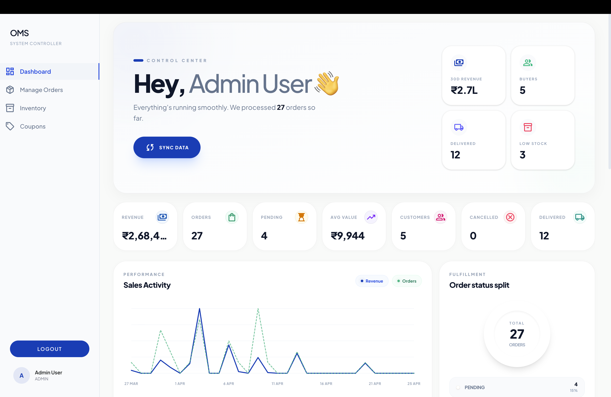

---

### 👤 User Dashboard

> Customer-facing dashboard with order summaries and quick links.

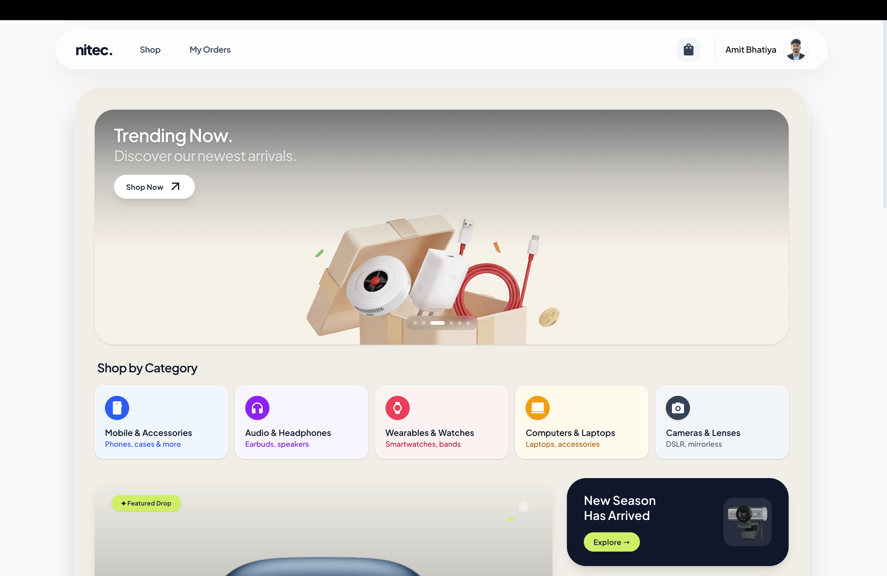

---

### 📋 Order Page

> Browse and filter all orders placed by customers.

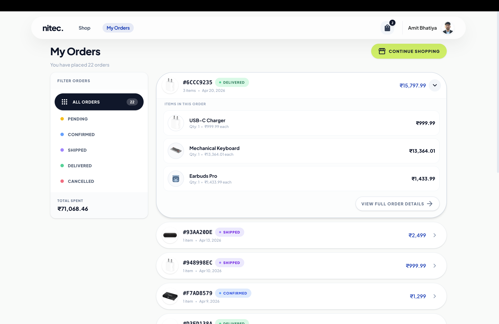

---

### 🔍 Order Detail Page

> Detailed view of a single order with itemized receipt breakdown.

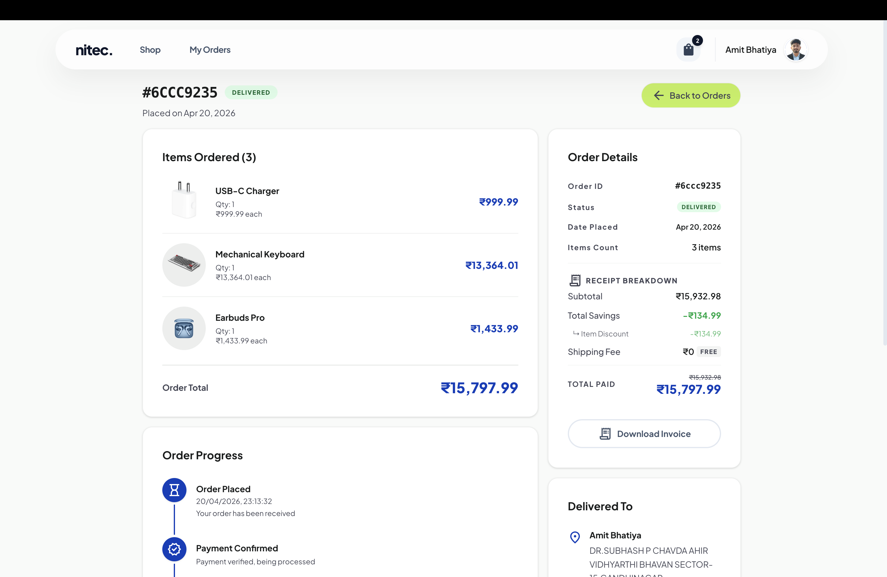

---

### 🗂 Manage Orders Page

> Admin view to update order status and manage fulfilment.

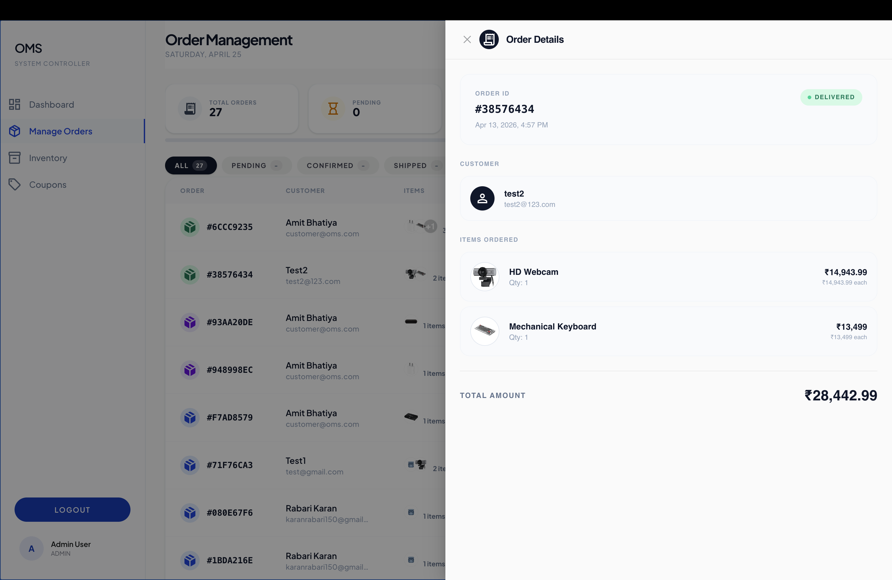

---

### 🛒 Cart Modal

> Interactive cart modal with item quantities and totals.


---

### 💳 Payment Page

> Checkout and payment processing flow.

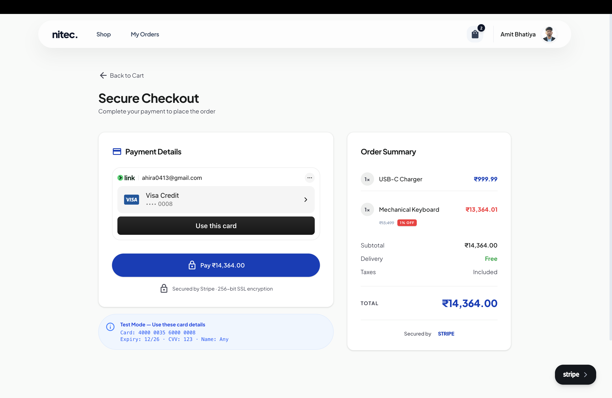

---

### 🧾 Invoice

> Auto-generated PDF invoice for completed orders.

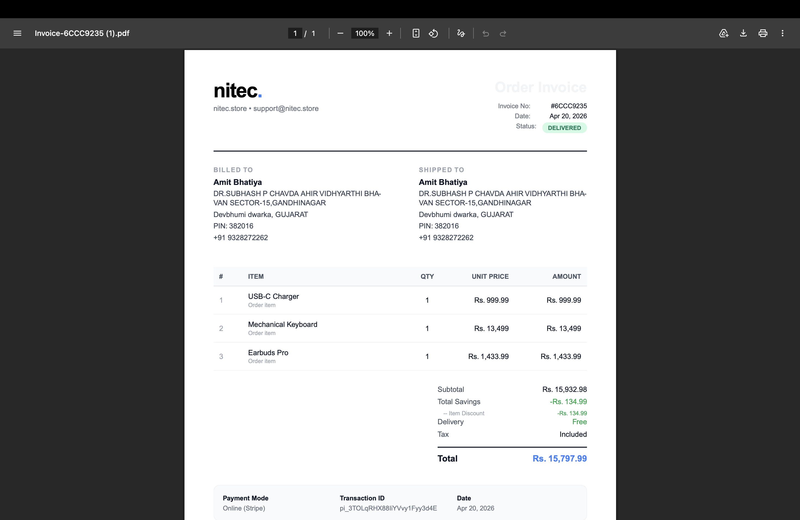

---

### 📦 Product List

> Admin product catalogue with search, filter, and edit actions.

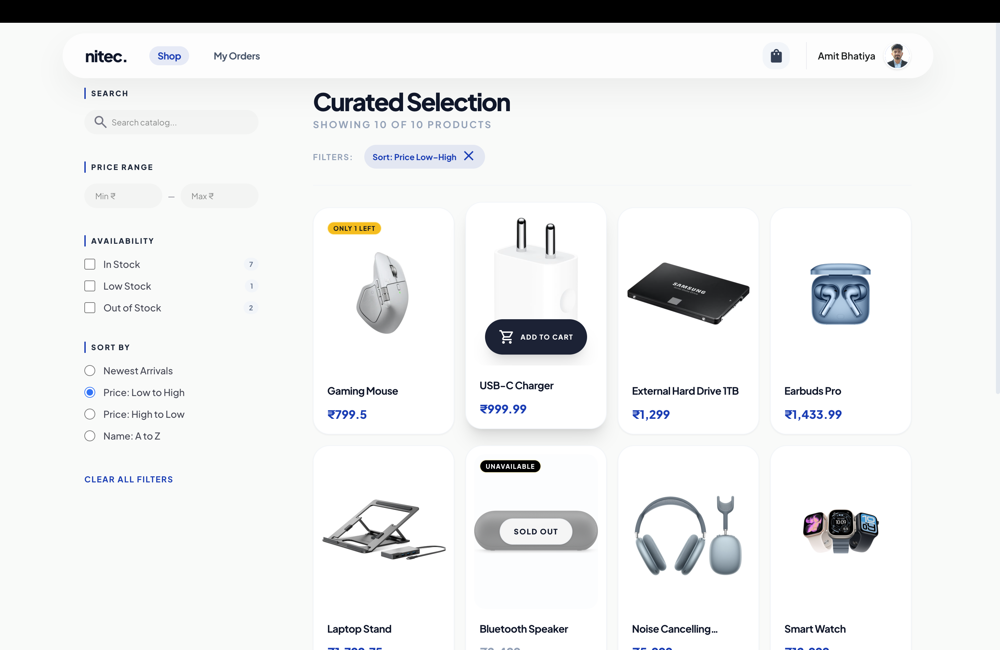

---

### 📤 Bulk Import Page

> Import products in bulk via CSV/Excel upload.

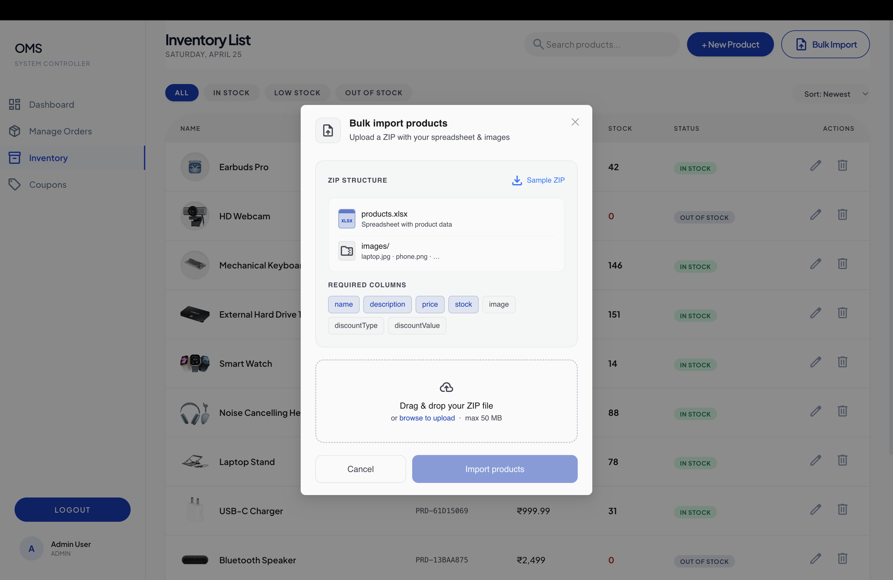

---

### 🏪 Inventory Page

> Track and update stock levels across all products.

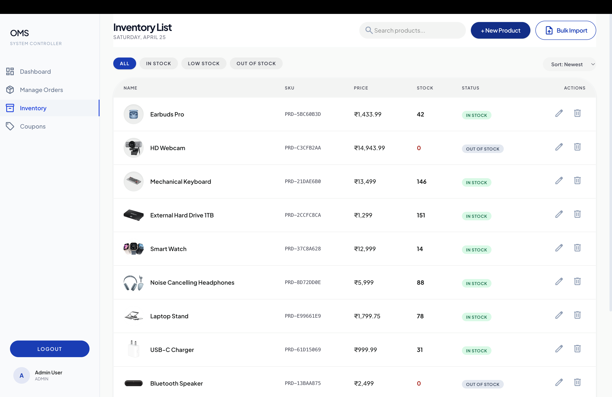

---

### 🏷 Coupons Page

> Create, view, and manage discount coupon codes.

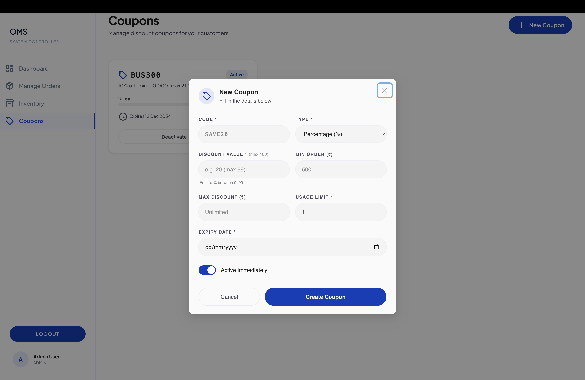

---

### 👤 Profile Page

> User profile with personal info and order history.

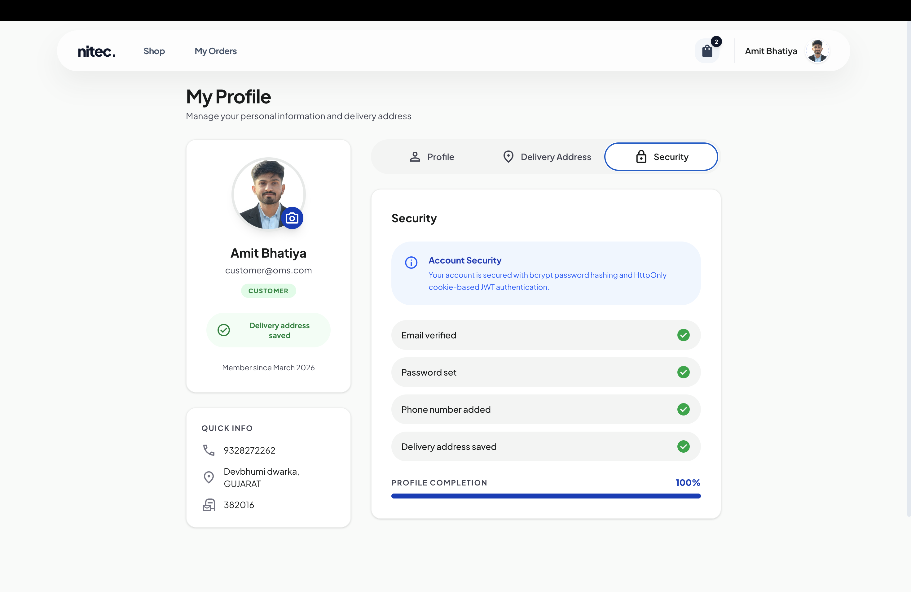

---

## ⚙️ Setup Instructions

### Prerequisites

- Node.js (v18+)
- MongoDB
- npm or yarn

---

### 🔧 Backend Setup

```bash
cd oms-backend
npm install
npm run dev
```

> The backend server will start on `http://localhost:5000` (or as configured in your `.env`).

---

### 🎨 Frontend Setup

```bash
cd oms-frontend
npm install
npm run dev
```

> The frontend dev server will start on `http://localhost:5173`.

---

### 🔑 Environment Variables

Create a `.env` file in `oms-backend/` with the following keys:

```env
PORT=5000
MONGO_URI=your_mongodb_connection_string
JWT_SECRET=your_jwt_secret
# Add any other required keys
```

---

## 🛠 Tech Stack

| Layer    | Technology                  |
| -------- | --------------------------- |
| Frontend | React, Vite, Zustand, Axios |
| Backend  | Node.js, Express.js         |
| Database | MongoDB (Mongoose)          |
| Auth     | JWT, bcrypt                 |
| Styling  | CSS Modules / Custom CSS    |
| PDF      | (PDF generation library)    |

---

## 📄 License

This project is for personal/educational use. Feel free to adapt it.
